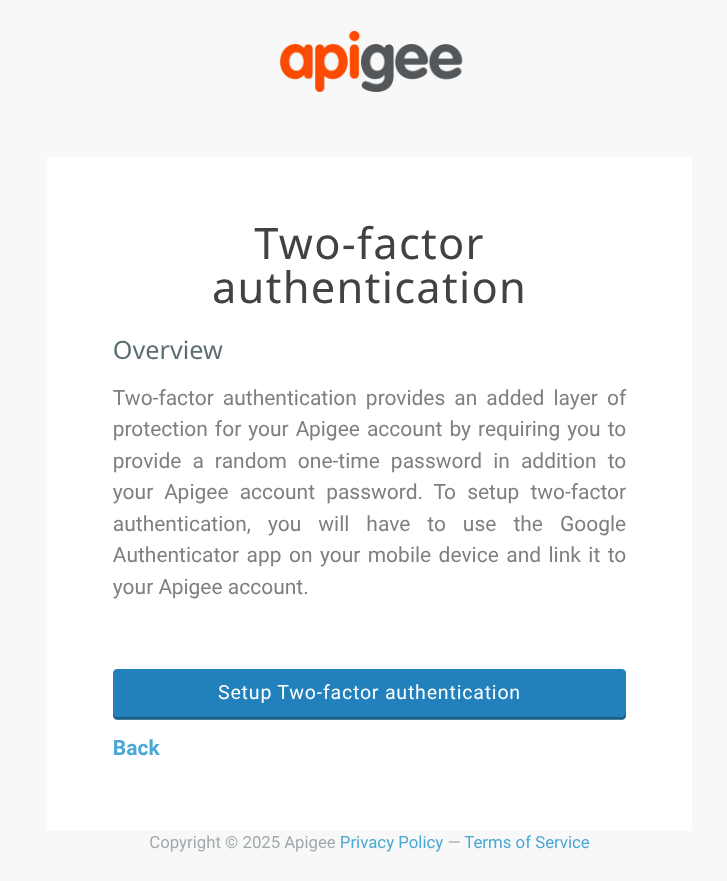
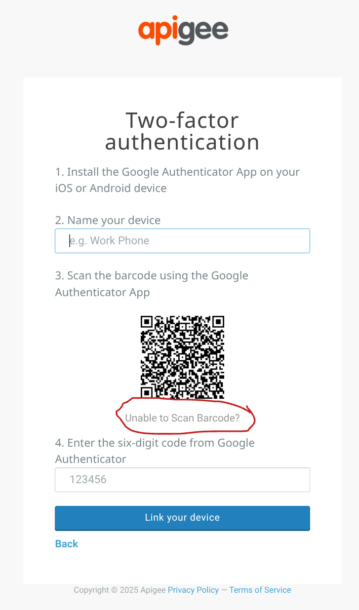

# Apigee Edge TOTP Generator

This directory contains a command-line tool to generate a Time-based One-time
Password (TOTP), as described in [IETF RFC 6238](https://tools.ietf.org/html/rfc6238).

This TOTP could be used as the 2nd factor when signing in to Apigee Edge.

This will be useful to you if:
- you have Apigee Edge SaaS
- you do not have SAML configured
- you use Apigee-provided 2FA on your account
- you have access to the 2FA _secret_
- you want a way to generate a TOTP in an automated way

In the normal case, the TOTP is assisted by an "Authenticator" app that you
install on your mobile phone. There are a number of suppliers of such apps; they
all work the same way and are based on the same TOTP standard.

The tool in this repo does something similar to what those apps do - it
generates a time-based one-time password. Unlike the mobile app tools you are
probably familiar with, the tool here does not _store_ your seeds for future
use.

## Disclaimer

This example is not an official Google product, nor is it part of an
official Google product.

## Building it

Requires:
- mvn 3.9.x
- Java11. I haven't tested on later versions of Java.

```console
mvn clean package
```

## Using it - Preparation

The TOTP process works with a secret key that is shared across the server side
and your authenticator app.  To use this tool, you must have the access to this
originating "seed" key.

Normally, when you set up 2FA with Apigee, or any other system that uses TOTP,
you will see a barcode displayed on the screen.  The typical process is to scan
the barcode with the camera on your phone, and that will automatically load the
secret into your Authenticator app. You never see the secret, aside from that
barcode.

Once you have loaded the secret into your Authenticator app, there is no way to
extract the originating secret. So if you already have 2FA set up with Apigee,
it's too late; you cannot use this tool.

If you want to use this command, you must first _unlink_ that secret from your
Apigee account, then initiate a new 2FA secret. Be aware: Unlinking means,
whatever mobile app you have set up, will no longer work as a supplier of TOTP
for Edge.



When you see the barcode, click the text that reads "xxx yyy zzz".




This will display a string of characters; that is your TOTP Secret. Copy THAT
string into a plain text file, and you can use it with this tool.

If you _ALSO_ want to set up a mobile app, copy the string of characters, and
then also scan the barcode with your mobile app. (If you do this you will be anle
to verify that the Java app here generates the same code as the mobile
authenticator app.)

## _Actually_ Using the tool

If you have stored your secret into the file "secretkey.txt", then from a bash
shell you can use this command to generate the TOTP:

```sh
cat ./secretkey.txt |
  java --class-path ./target/lib/\*.jar  \
  -jar ./target/com.google.dchiesa-apigee-edge-totp-20250725.jar -k -
```

I suggest that you do not type in the seed key directly on the command line.
While it is possible to do so, taking the approach I show here - using cat and
the filename - means the seed key is not visible in the command line, in a script
file, or in command history. This reduces the likelihood of key leakage. You can
protect the file, and that protects your key.

In contrast, this bit of clever bash syntax:

```sh
java --class-path ./target/lib/\*.jar  \
   -jar ./target/com.google.dchiesa-apigee-edge-totp-20250725.jar \
   -k $(<./secretkey.txt)
```

... has a different effect. It reads from the file, but it places the contents
into an argument, in the command line. So that secret _will_ appear in the
output of a ps command, for example.

Regardless how you provide the key, the output of the command will be something
like this:

```console
Current: 351395
Seconds remaining: 8
Next: 436006
```

The TOTP changes every 30 seconds. If you prefer to not get the information
about how much time is remaining and what the next code will be in the output,
you can pass the -q option, in which case the tool will display only the current OTP.


## Implementation Notes

This tool relies on [java-otp from jchambers](https://github.com/jchambers/java-otp/tree/main)
for the TOTP implementation.

In fact there is nothing that is specific to Apigee Edge included in this
tool. If you have an alternative tool, implemented in C# or Python or something
else, that generates TOTP according to [the IETF standard (RFC
6238)](https://tools.ietf.org/html/rfc6238), you could just as easily use THAT
to generate TOTP for use with the Apigee Edge SaaS signin.

The TOTP parameters used by Apigee Edge, that this tool defaults to:

| factor        | value      |
|---------------|------------|
| time step     | 30 seconds |
| HMAC hash     | sha1       |
| code length   | 6 digits   |
| seed encoding | base 32    |

As far as I know, Google does not document these parameters for use with Apigee
Edge SaaS. But these same values are used by virtually all TOTP
implementations. The values have been in use for years by Apigee Edge. It seems
safe to assume they will not change, unless we suddenly discover some critical
new security problem.

## About Information Security

The secret is a 2nd factor for authentication. It should be protected as if it
is a password. It is not a password; it is a random number to be used as the
second factor. To authenticate to Edge SaaS, a person or system would need both
the password of the account, as well as the secret. But it is sensitive
material. Take appropriate precautions.


## Support

There is no support for this tool. If you have questions on it, you should post
them on [the Apigee-related
forum](https://discuss.google.dev/c/google-cloud/cloud-apigee/104) in the Google
Cloud community site. But be aware, there is no service-level for responses on
that forum.  It's a community site.

## License

This material is [Copyright © 2025 Google LLC](./NOTICE).
and is licensed under the [Apache 2.0 License](LICENSE).

